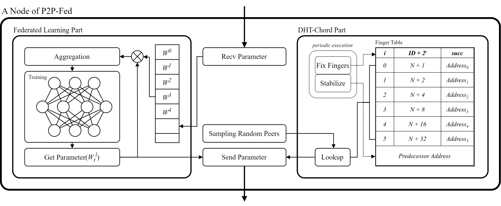
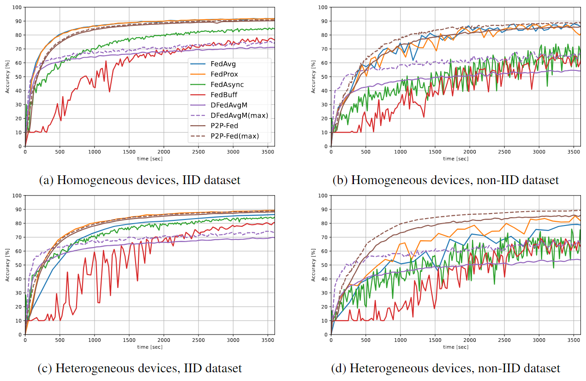

# **P2P-Fed** : A Decentralized Federated Learning Platform on Structured Peer-to-peer Systems

<p></p>

This repository is the official implementation of P2P-Fed: A Decentralized Federated Learning Platform on Structured Peer-to-peer Systems.

## Requirements & Environment Setup
For environment requirements and setup, please refer to the [```scripts/README```](scripts/README.md).

## Experiment & Evaluation
- To reproduce the experiments in the paper, refer to the following:
    ```shell
    # In the project directory
    bash scripts/runrunrun.sh
    ```
    The script runs other scripts, then creates and runs several nodes(containers).

- At the end of the experiment, the results will be recorded in ```log/DFL(or CFL)```, separated by CFL/DFL and by time.

## Results

Our work achieves the following performance on :

### Test Accuracy Comparison of Four Scenarios with ResNet-18 on CIFAR-10 datasets.

<p></p>

### Overview of test accuracy across various datasets and model settings within the given time
<center>

| Method                | MNIST               | Fashion MNIST       | CIFAR10            | CIFAR100           | Shakespeare        |
|-----------------------|---------------------|---------------------|--------------------|--------------------|--------------------|
|                       | 1000s               | 1200s               | 3500s              | 4500s              | 1000s              |
| FedAvg                | 86.7 ± 2.9          | 73.1 ± 1.5          | 79.1 ± 0.1         | 51.4 ± 0.1         | 43.6 ± 0.8         |
| FedProx               | 87.0 ± 5.0          | 75.7 ± 5.3          | 83.9 ± 1.4         | 55.4 ± 0.1         | **49.4 ± 3.1**     |
| FedAsync              | 26.1 ± 12.8         | 36.3 ± 12.2         | 65.4 ± 10.5        | 47.6 ± 1.5         | 45.0 ± 41.2        |
| FedBuff               | 34.0 ± 11.2         | 37.7 ± 9.6          | 63.2 ± 3.6         | 35.3 ± 1.6         | 41.5 ± 15.5        |
| DFedAvgM              | 37.6 ± 0.6          | 38.9 ± 0.8          | 53.9 ± 0.2         | 20.6 ± 0.7         | 17.4 ± 0.4         |
|                       | (58.0 ± 2.3)        | (56.8 ± 1.1)        | (65.1 ± 2.3)       | (26.0 ± 1.0)       | (44.5 ± 0.3)       |
| P2P-Fed               | **94.2 ± 1.0**      | **80.2 ± 1.3**      | **85.6 ± 0.3**     | **58.6 ± 0.2**     | 46.9 ± 0.7         |
|                       | **(97.8 ± 0.0)**    | **(88.7 ± 0.2)**    | **(89.1 ± 0.1)**   | **(62.0 ± 0.1)**   | **(68.1 ± 11.3)**  |
</center>
The numbers in brackets represent the accuracy of the node with the highest test accuracy, and the bold numbers denote the best result.

# License
Our work is licensed under [CC-BY-NC-SA 4.0](license.txt). Please give appropriate credit, use the material for non-commercial purposes only, and distribute any modified content under the same license.
