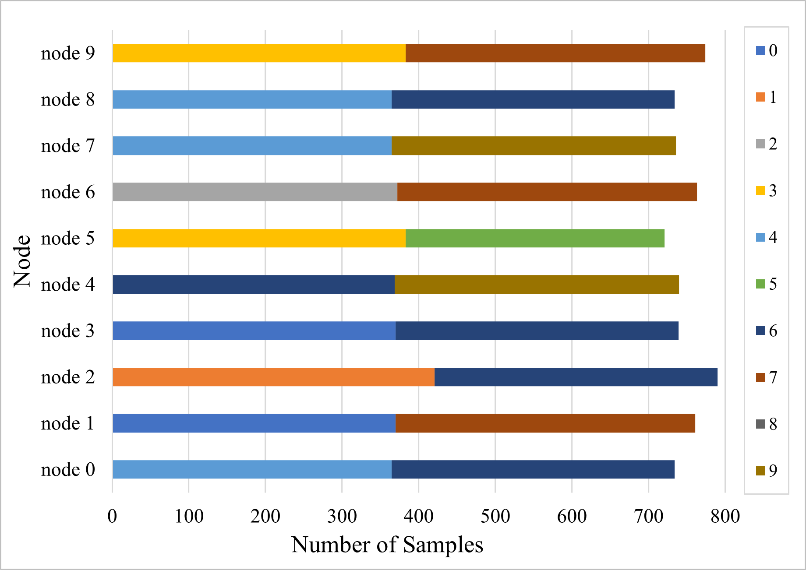
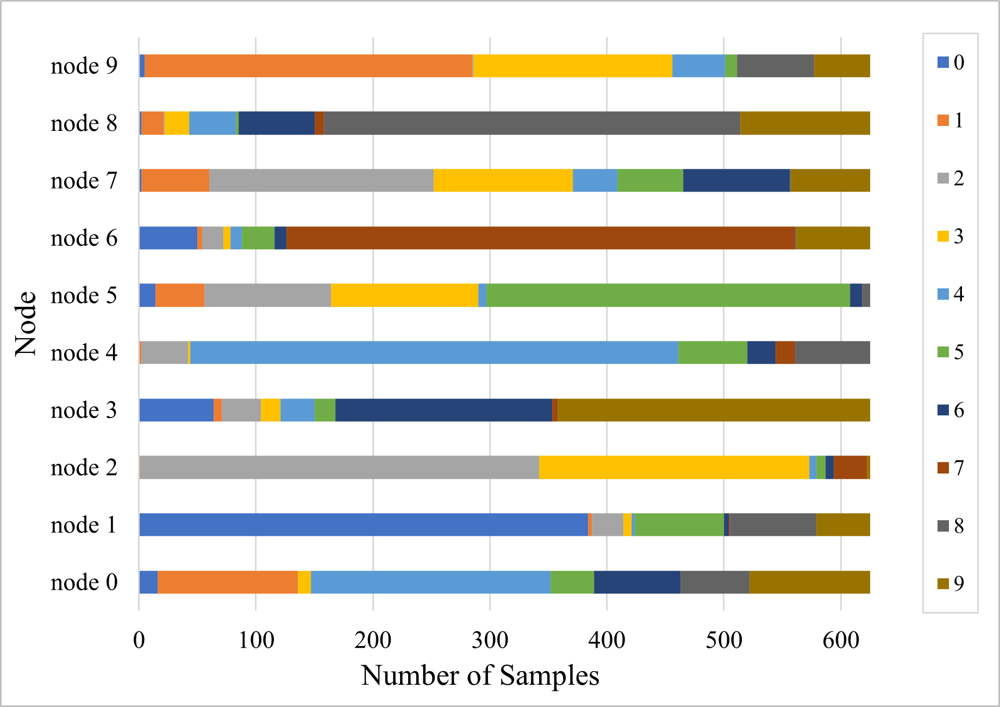
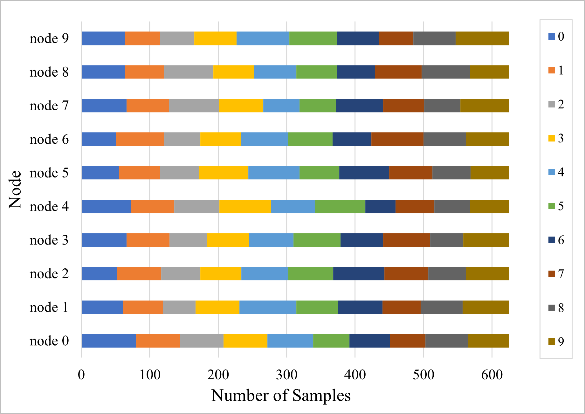

# Datasets

## Data Partitioning Methods
We partitioned each of the datasets listed below according to the respective options.
In our experiments(Figure[4] and Table[2] of the paper), we used only non-IID setting but cifar10.
### MNIST, Fashion MNIST
---
We use Shards partition in MNIST and Fashion MNIST same as [[1]](#1). 
This method distributes data from only two classes to each node in equal numbers. \
\
For example, among the total of 80 partitions, 10 partitions are as follows:
- MNIST, non-IID
<p></p>

### CIFAR10, CIFAR100
---
We use the Dirichlet distribution in CIFAR10 and CIFAR100 similar to [[2]](#2).
Using the Dirichlet distribution to generate prior probabilities for each class of each node, this method distributes data using these probabilities. We adjust the parameter $\alpha$, which adjusts the variance of the partition.

For example, among the total of 80 partitions, 10 partitions are as follows:
- CIFAR10, non-IID($\alpha$ = 0.3)
<p></p>

- CIFAR10, IID($\alpha$ = 1000)
<p></p>

### Shakespeare
---
We used the Shakespeare dataset from [[3]](#3), implemented in PyTorch by [[4]](#4).
We categorize the data by speaking roles, and randomly selected 80 roles. This created a naturally occurring non-IID scenario.

## Code
The code's of Shard partition and Dirichlet distribution is in ```/data/data_partitioner.py```.  The partition codes of Shakespeare dataset is in ```/src/learning/datasets/``` which is same with [FedLab](https://github.com/SMILELab-FL/FedLab/tree/edc47f4ab5d613d6720eb5a8f03f4eaf53b16482/datasets) [[4]](#4)

### Example (non-IID data(Shards partition) on MNSIT)
```shell
# with conda
# assume the number of node is 20
python data/data_patitioner.py -R ./data -D mnist -A 0 -S 2 -N 20
```

## References

<a id="1">[1]</a> 
McMahan, Brendan, et al. "Communication-efficient learning of deep networks from decentralized data." Artificial intelligence and statistics. PMLR, 2017.

<a id="2">[2]</a> 
Yurochkin, Mikhail, et al. "Bayesian nonparametric federated learning of neural networks." International conference on machine learning. PMLR, 2019.

<a id="3">[3]</a> 
Caldas, Sebastian, et al. "Leaf: A benchmark for federated settings." arXiv preprint arXiv:1812.01097 (2018).

<a id="4">[4]</a> 
He, Chaoyang, et al. "Fedml: A research library and benchmark for federated machine learning." arXiv preprint arXiv:2007.13518 (2020).
